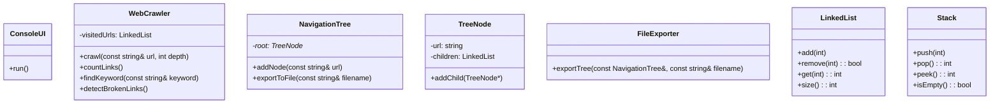

# Proyecto Explorador de Enlaces Web

## 1. Introducción

Este proyecto consiste en desarrollar una aplicación en C++ que explore recursivamente los enlaces de una página web dada, construyendo un árbol de navegación en memoria. El objetivo es analizar los enlaces de un sitio web hasta un nivel de profundidad especificado, diferenciando entre enlaces internos y externos.

## 2. Descripción del problema

El sistema debe construir un árbol de navegación a partir de una URL raíz, considerando solo los enlaces del mismo dominio para la exploración recursiva. Los enlaces externos se incluirán en el árbol pero no se seguirán. Se debe evitar la exploración de enlaces ya visitados para prevenir ciclos infinitos.

## 3. Requerimientos del sistema

### 3.1 Requerimientos funcionales

1. Construir un árbol de navegación a partir de una URL raíz.
2. Contabilizar el total de enlaces, enlaces internos, enlaces externos y la profundidad del árbol.
3. Buscar una palabra clave y determinar el número de enlaces a visitar desde la raíz hasta encontrarla.
4. Detectar enlaces rotos en el sitio.
5. Exportar el árbol de navegación a un archivo.

### 3.2 Requerimientos no funcionales

- Uso de la librería `curl` para acceder a los archivos web.
- Implementación en C++ siguiendo el modelo de 3 capas: presentación, lógica de negocio y datos.
- Código modular, legible y con pruebas unitarias.

## 4. Casos de uso

- Construcción del árbol de navegación.
- Análisis de enlaces internos y externos.
- Búsqueda de palabras clave en el árbol.
- Detección de enlaces rotos.
- Exportación del árbol a un archivo.

## 5. Diseño de la arquitectura

### 5.1 Capas del sistema

- **Capa de presentación**: Interfaz de consola para interactuar con el sistema.
- **Capa de negocios**: Lógica de navegación y análisis de enlaces.
- **Capa de datos**: Manejo de la comunicación con archivos y almacenamiento de datos.

### 5.2 Diagrama de componentes y clases

## 6. Estructuras de datos y diagrama de clases

- **Árbol de navegación**: Representado por `NavigationTree` y `TreeNode`, utilizando `LinkedList` para gestionar los nodos hijos.
- **Conjunto de URLs visitadas**: Implementado con `LinkedList` para evitar ciclos.
- **Pila de exploración**: Implementada con `Stack` para gestionar la exploración de enlaces en profundidad.

## 7. Plan de pruebas

- Pruebas unitarias para cada clase (`WebCrawler`, `NavigationTree`, `TreeNode`, `LinkedList`, `Stack`).
- Pruebas de integración para la construcción del árbol y análisis de enlaces.
- Validación de la exportación del árbol y detección de enlaces rotos.

## 8. Cronograma y entregables

- Fase 1: Análisis y diseño (1 semana).
- Fase 2: Implementación de la estructura base y pruebas (2 semanas).
- Fase 3: Desarrollo de la interfaz de usuario y exportación (1 semana).
- Entrega final: Informe completo, código fuente, pruebas y documentación.

## 9. Plan de implementación en código

**Nota**: Archivos `.h` en `include/`, archivos `.cpp` en `src/` divididos por dominio (`business/`, `data/`, `ui/`). Se recomienda seguir TDD (pruebas antes de la implementación).

### Pasos en orden lógico:

1. **Estructuras básicas**

   - `LinkedList`, `Stack`, `TreeNode`, `NavigationTree`.

2. **Lógica de negocio**

   - `WebCrawler` con `crawl()`, `countLinks()`, `findKeyword()`, `detectBrokenLinks()`.

3. **Persistencia**

   - `FileExporter` para exportar el árbol a un archivo.

4. **Interfaz de usuario (UI)**

   - `ConsoleUI` con opciones para construir el árbol, analizar enlaces, buscar palabras clave, detectar enlaces rotos y exportar.

5. **Pruebas**

   - Tests unitarios e integración en la carpeta `tests/`.
   - Validación de cada funcionalidad del sistema.

### Actualizaciones Clave

- **Estructuras de Datos**: Se añadieron `LinkedList` y `Stack` a la sección de estructuras de datos, reflejando su implementación y uso en el proyecto.
- **TreeNode y NavigationTree**: Se destacó el uso de `LinkedList` para gestionar los nodos hijos en la estructura del árbol.
- **WebCrawler**: Se actualizó para usar `LinkedList` en la gestión de URLs visitadas, lo cual se alinea con el requisito del proyecto de evitar ciclos.
