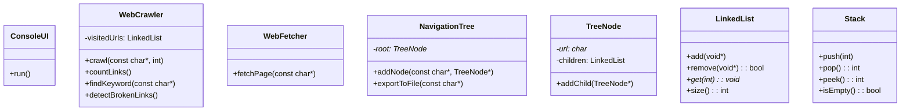

# Proyecto Explorador de Enlaces Web

## 1. Introducción

Este proyecto consiste en desarrollar una aplicación en C++ que explore recursivamente los enlaces de una página web dada, construyendo un árbol de navegación en memoria. El objetivo es analizar los enlaces de un sitio web hasta un nivel de profundidad especificado, diferenciando entre enlaces internos y externos.

## 2. Descripción del problema

El sistema debe construir un árbol de navegación a partir de una URL raíz, considerando solo los enlaces del mismo dominio para la exploración recursiva. Los enlaces externos se incluirán en el árbol pero no se seguirán. Se debe evitar la exploración de enlaces ya visitados para prevenir ciclos infinitos.

## 3. Requerimientos del sistema

### 3.1 Requerimientos funcionales

1. Construir un árbol de navegación a partir de una URL raíz.
2. Contabilizar el total de enlaces, enlaces internos, enlaces externos y la profundidad del árbol.
3. Buscar una palabra clave y determinar el número de enlaces a visitar desde la raíz hasta encontrarla.
4. Detectar enlaces rotos en el sitio.
5. Exportar el árbol de navegación a un archivo.

### 3.2 Requerimientos no funcionales

- Uso de la librería `libcurl` para acceder a los archivos web.
- Implementación en C++ sin uso de STL, utilizando estructuras de datos y manejo de cadenas personalizados.
- Código modular, legible y con pruebas unitarias.

## 4. Capas del sistema

El proyecto sigue una arquitectura de tres capas:

- **Capa de presentación**: Maneja la interfaz de consola.
- **Capa de negocio**: Contiene la lógica de exploración y análisis de enlaces.
- **Capa de datos**: Maneja almacenamiento y exportación a archivos.

## 5. Componentes principales

### 5.1 WebCrawler

Clase principal de la capa de negocio. Realiza la navegación recursiva y contiene las operaciones:

- `void crawl(const char* rootUrl, int maxDepth);`
- `int countLinks() const;`
- `bool findKeyword(const char* keyword) const;`
- `void detectBrokenLinks() const;`

### 5.2 WebFetcher

Módulo auxiliar basado en `libcurl` para descargar contenido HTML:

- `char* fetchPage(const char* url);`

El contenido debe ser liberado manualmente con `memFree()`.

### 5.3 Utilidades de memoria y cadenas

- `memAlloc`, `memRealloc`, `memCopy`, `memFree`: reemplazos de `malloc`, `realloc`, `memcpy`, `free`.
- `stringLength`, `compareString`, `copyString`: utilidades para manejar `char*`.

### 5.4 Estructuras de datos personalizadas

- `LinkedList`: lista enlazada simple para almacenar nodos hijos y URLs visitadas.
- `Stack`: para posibles futuras implementaciones de recorrido iterativo.
- `TreeNode` y `NavigationTree`: representan el árbol de navegación.

## 6. Diagrama de clases



## 7. Plan de pruebas

- Pruebas unitarias para cada clase y módulo: `WebCrawler`, `WebFetcher`, `TreeNode`, `LinkedList`, `Stack`, `StringUtils`, `MemoryUtils`.
- Pruebas de integración para navegación, conteo y búsqueda.

Ejemplo de prueba:

```cpp
void testFetchPage() {
    char* html = fetchPage("http://example.com");
    assert(html != nullptr);
    assert(stringLength(html) > 0);
    // ... verificar contenido ...
    memFree(html);
}
```

## 8. Consideraciones de memoria

Todo el manejo de memoria es manual y se usa `new[]`/`delete[]` o funciones de `MemoryUtils`. Se recomienda verificar con herramientas como `valgrind` si se desea asegurar ausencia de fugas.

## 9. Estructura del proyecto

```
include/         # Headers compartidos
src/             # Implementación de negocio, datos y utilidades
src/business/    # WebCrawler, WebFetcher
src/utility/     # StringUtils, MemoryUtils
src/data/        # TreeNode, NavigationTree
src/ui/          # ConsoleUI

bin/             # Ejecutables de prueba
lib/             # Biblioteca estática

CMakeLists.txt   # Configuración de build
```

---
